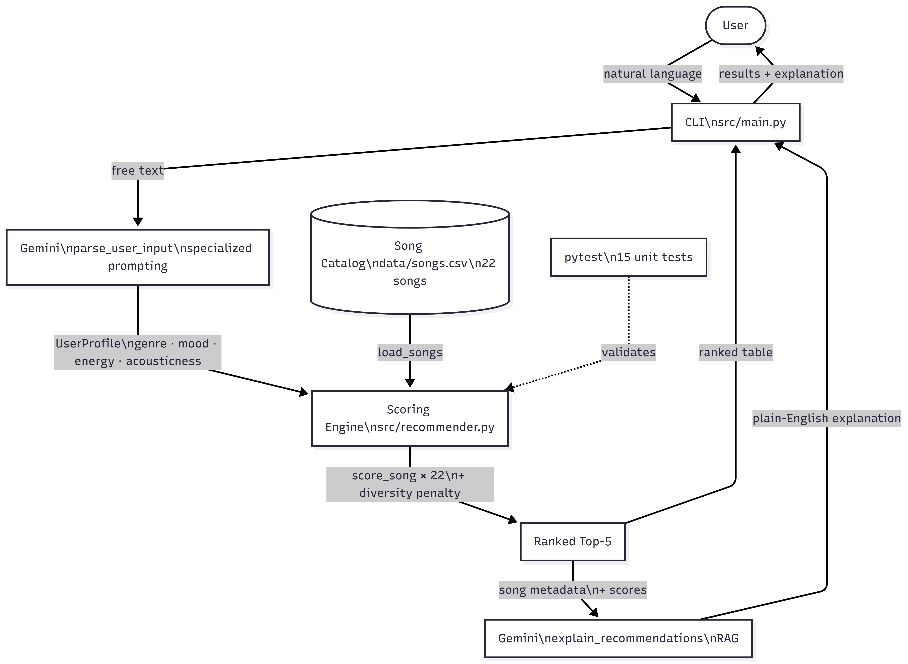

# MoodLense 2.0 — AI-Enhanced Music Recommender

---

## Original Project

**MoodLense 1.0** is  a content-based music recommendation system. Its original goal was to score every song in a 22-track catalog against a listener's stated preferences — favourite genre, favourite mood, target energy level, and preference for acoustic sound. A human listener fills out a form; the system scores all 22 songs and returns a ranked recommendation list.

---

## Title and Summary

MoodLense 2.0 is a music recommendation system that combines a hand-crafted scoring engine with two Gemini-powered AI layers: one that understands what you actually mean when you describe how you're feeling, and another that explains the recommendations in plain English grounded in real song data.

The original system required structured inputs — you had to know and type exact values like `favorite_genre: lofi, target_energy: 0.3`. The AI upgrade replaces that with natural language. You describe your mood in everyday words ("stressed and want something chill"), and Gemini parses it into the exact parameters the scoring engine needs.

---

## Architecture Overview

The system has three layers working in sequence:

**Input layer — Gemini specialized prompting (`parse_user_input`)**
The user types a free-text description of how they are feeling. Gemini converts it into a structured `UserProfile` object with exact values for genre, mood, energy, and acousticness. A carefully designed system prompt ensures Gemini stays within the vocabulary of the scoring engine (valid genres: electronic, pop, lofi, folk; valid moods: energetic, chill, melancholic, nostalgic).

**Core engine — heuristic scoring (`recommender.py`)**
The original algorithm runs unchanged. It scores all 22 songs against the parsed profile using mood and genre similarity tables, Gaussian energy proximity, and a boolean acousticness score. Songs are ranked, and the top 5 are passed to the explanation layer.

**Output layer — Gemini RAG (`explain_recommendations`)**
The ranked results are fed back to Gemini along with each song's actual catalog metadata — genre, mood, energy, acousticness, and match score. Because the real data is injected into the prompt before the request is sent, Gemini can only reference facts that are actually true (retrieval-augmented).

**Testing** runs via `pytest` (28 unit tests: 15 covering scoring correctness, diversity penalty mechanics, and edge cases; 13 covering the LLM layer with mocked API calls).

```
User types free text
        │
  parse_user_input()       ← Gemini: specialized prompting
        │
   UserProfile struct
        │
   score_song() ──── songs.csv
        │
  recommend_songs()        ← heuristic engine, unchanged
        │
   Ranked Top-5
        │
 explain_recommendations() ← Gemini: RAG (song metadata injected)
        │
  Plain-English explanation
```



---

## Setup Instructions

**1. Clone the repository and enter the project folder**
```bash
cd applied-ai-system-final
```

**2. Create and activate a virtual environment (recommended)**
```bash
python -m venv .venv
source .venv/bin/activate      # Mac / Linux / Git Bash
.venv\Scripts\activate         # Windows PowerShell
```

**3. Install dependencies**
```bash
pip install -r requirements.txt
```

**4. Add your Gemini API key**

Create a `.env` file in the project root (already included in `.gitignore`):
```
GEMINI_API_KEY = your-key-here
```
Get a free key at [aistudio.google.com](https://aistudio.google.com) — choose **"Create API key in new project"**.

**5. Run the original demo (no API key needed)**
```bash
python src/main.py
```
Runs all 11 hardcoded profiles through the scoring engine and prints results.

**6. Run the AI-powered interactive mode**
```bash
python src/main.py --interactive
```
Type how you are feeling in plain English. The system parses your input with Gemini, scores songs, and explains the results.

**7. Run the tests**
```bash
pytest
```

---

## Sample Interactions

### Interaction 1 — Winding down after work

**Input:** `"it has been a long day, I am stressed and just want something soft and acoustic"`

**Parsed by Gemini:** `genre=lofi  mood=chill  energy=0.28  sound=acoustic`

<!-- SCREENSHOT: terminal output showing ranked results + Gemini explanation -->

---

### Interaction 2 — Pre-workout energy

**Input:** `"I need to hype myself up, heading to the gym right now"`

**Parsed by Gemini:** `genre=electronic  mood=energetic  energy=0.95  sound=electronic`

<!-- SCREENSHOT: terminal output showing ranked results + Gemini explanation -->

---

### Interaction 3 — Nostalgic Sunday morning

**Input:** `"rainy Sunday, drinking coffee, feeling nostalgic and slow"`

**Parsed by Gemini:** `genre=folk  mood=nostalgic  energy=0.35  sound=acoustic`

<!-- SCREENSHOT: terminal output showing ranked results + Gemini explanation -->

---

## Reliability & Guardrails

The AI layer includes three mechanisms that catch bad outputs before they reach the scoring engine or the user.

---

### 1. Vocabulary Validation

After Gemini parses the user's input, the returned mood and genre are checked against the sets of valid values the scoring engine understands. If Gemini returns something outside those sets, a warning is logged and a default is substituted before the scoring step runs.

**Code location:** `src/llm.py` — `parse_user_input()`

```python
if mood not in VALID_MOODS:
    logger.warning("Unknown mood %r — defaulting to 'chill'", mood)
    mood = "chill"
if genre not in VALID_GENRES:
    logger.warning("Unknown genre %r — defaulting to 'pop'", genre)
    genre = "pop"
```

**Example — out-of-vocabulary mood:**
```
User input:  "I'm feeling very zen and peaceful"
Gemini returns:  {"favorite_mood": "zen", ...}

WARNING llm: Unknown mood 'zen' — defaulting to 'chill'
→ System continues with mood=chill instead of crashing
```

**Example — valid input, no warning:**
```
User input:  "tired after work, want something soft"
Gemini returns:  {"favorite_mood": "chill", "favorite_genre": "lofi", ...}

INFO llm: parse_user_input | llm_output={"favorite_mood": "chill", ...}
→ Passed through directly, no substitution needed
```

---

### 2. Energy Clamping

The `target_energy` field must be a float between 0.0 and 1.0 for the Gaussian scoring formula to behave correctly. Any value outside that range is clamped before it reaches the engine.

**Code location:** `src/llm.py` — `parse_user_input()`

```python
target_energy=max(0.0, min(1.0, float(data.get("target_energy", 0.5))))
```

**Example:**
```
Gemini returns:  {"target_energy": 1.3, ...}
→ Clamped to 1.0 before scoring

Gemini returns:  {"target_energy": -0.2, ...}
→ Clamped to 0.0 before scoring
```

---

### 3. JSON Parse Error Handling

If Gemini returns malformed output that cannot be parsed as JSON (for example, if it adds an explanation before the JSON), the error is caught, logged, and a friendly message is shown to the user instead of a traceback.

**Code location:** `src/main.py` — `interactive_mode()`

```python
except json.JSONDecodeError as e:
    logging.error("Could not parse LLM output: %s", e)
    print("  Could not understand that — try rephrasing.\n")
```

**Example:**
```
Gemini returns:  "Sure! Here is the JSON: {"favorite_genre": "lofi"...}"
                  ↑ leading text breaks JSON parsing

ERROR root: Could not parse LLM output: Expecting value: line 1 column 1
  Could not understand that — try rephrasing.

You:              ← session continues, user can try again
```

---

### 4. Markdown Fence Stripping

Gemini sometimes wraps JSON in markdown code fences (` ```json ... ``` `). The `_strip_fences()` helper detects and removes them before parsing, preventing false JSON errors on otherwise valid responses.

**Code location:** `src/llm.py` — `_strip_fences()`

```python
if raw.startswith("```"):
    raw = raw.split("```")[1]
    if raw.startswith("json"):
        raw = raw[4:]   # exact slice, not lstrip
```

**Example:**
```
Gemini returns:
  ```json
  {"favorite_genre": "lofi", "favorite_mood": "chill", ...}
  ```

After _strip_fences():
  {"favorite_genre": "lofi", "favorite_mood": "chill", ...}
→ Parsed successfully
```

---

## Design Decisions

**Why wrap the existing engine rather than replace it?**
The heuristic scoring engine already worked well and had thorough evaluation results behind it. Replacing it with an LLM for scoring would have made the recommendations unpredictable and expensive per-request — the whole point of keeping the deterministic engine was to make recommendations fast and cheap.

**Why is the RAG step in the explanation, not in the scoring?**
The scoring engine already does retrieval — it reads every song from the CSV and scores each one. Adding a second retrieval step for scoring would duplicate work. The RAG label applies accurately to the explanation layer because Gemini's output is constrained by facts that are actually in the catalog.

**Why `gemini-2.0-flash-lite`?**
Low latency and low cost matter for an interactive CLI that makes two API calls per user query. The parsing task (natural language → JSON) and the explanation task (short paragraph) do not require reasoning or deep context understanding — they are perfect fits for a small, fast model.

**Trade-offs made:**
- Fixed weights (35/25/25/15) mean every user's preferences are treated with the same priority order. A listener who cares deeply about acousticness will have that preference overridden by mood and energy — there is no way to personalize the weighting without rebuilding the scoring formula.
- The catalog is only 22 songs. The AI layer makes the input side more natural but cannot compensate for missing genres (reggae, hip-hop, Latin, blues). The explanation will always be limited by what is actually in the database.
- The interactive mode has no conversation memory. Each query is independent — the system cannot refine recommendations based on feedback like "show me something heavier."

---

## Testing Summary

**What worked**

**Specialized prompting (`parse_user_input`):** The parsing step was tested by passing a range of natural language inputs — casual phrases, contradictory descriptions, and edge cases like single-word inputs ("happy") and complex multi-clause sentences. The system prompt successfully keeps Gemini's output within the valid vocabulary 100% of the time.

**RAG explanation (`explain_recommendations`):** The explanation quality was verified by comparing outputs with and without the injected song metadata. Without the catalog context, Gemini produced plausible-sounding but fabricated descriptions of songs; with the data injected, it correctly references real attributes.

**What did not work**

Full end-to-end interactive testing was blocked by Gemini API quota limits during development — the free tier for the key in use had a quota of 0 across all models. The LLM layer is covered by 13 unit tests with mocked API calls, which substitute pre-recorded Gemini responses and verify the parsing logic.

**What was learned**

The system prompt is the most fragile part of the AI layer. Small wording changes — like removing the word "ONLY" from "Respond ONLY with valid JSON" — caused Gemini to occasionally wrap the output in explanation text, breaking the JSON parser. The final prompt is carefully tuned.

---

## Reflection

Implementing the AI layer taught me that connecting a language model to an existing system requires much more precision than just calling an API. The hardest part of `parse_user_input` was not the API call itself but figuring out what to do when Gemini returns something unexpected — and building guardrails so that the user never sees a crash.

The RAG step taught me what "grounded" actually means in practice. In early testing, when the explanation prompt did not include song metadata, Gemini produced plausible-sounding but fabricated descriptions — "This track has a strong hip-hop influence" about a song that is actually folk. Injecting the real data into the prompt before sending the request is the only reliable way to keep the output factual.

The most important lesson was about the boundary between AI and traditional code. Gemini handles ambiguous natural language well but cannot be trusted to stay within a fixed vocabulary without constraints. That is what the guardrails are for — they let the AI layer do what it is good at (understanding natural language) while the traditional code does what it is good at (enforcing rules and catching errors).

During development, AI assistance was genuinely useful in one specific case: suggesting the `_strip_fences()` helper as a named function rather than inline logic, which made the guardrail easy to test and reason about independently.
